<!--
  GitHub Profile README — Serhat Hançer
  Repository: https://github.com/alsanakoala/alsanakoala
-->

<picture>
  <source media="(prefers-color-scheme: dark)" srcset="./assets/serhat-hancer-banner-dark.svg">
  <source media="(prefers-color-scheme: light)" srcset="./assets/serhat-hancer-banner-light.svg">
  
</picture>

<div align="center">
  <a href="https://www.linkedin.com/in/serhat-han%C3%A7er-a57078279/" target="_blank">
    
  </a>
  <a href="mailto:hancer_offical2@hotmail.com">
    
  </a>
  <a href="https://github.com/alsanakoala?tab=followers">
    
  </a>
  
</div>

<p align="center">
  <samp>BACKEND SYSTEMS · FULL-STACK PRODUCTS · DOCUMENT INTELLIGENCE · QUALITY ENGINEERING</samp>
</p>

---

## `01 // engineering profile`

I am a **Software Engineer from Türkiye** focused on transforming complex operational needs into dependable software. My work combines **backend architecture**, **full-stack product engineering**, **public-sector and enterprise systems**, and **intelligent document processing**.

```ts
const serhat = {
  role: "Software Engineer",
  location: "Türkiye",
  primaryStack: [
    "Java", "Spring Boot", "React", "TypeScript", "PostgreSQL", "Docker"
  ],
  focus: [
    "Enterprise & public-sector systems",
    "Secure REST APIs and role-based workflows",
    "Document intelligence and applied NLP",
    "Testing, CI/CD and production delivery"
  ],
  principle: "Build software that remains understandable under pressure."
} as const;
```

## `02 // what I build`

<table>
  <tr>
    <td width="33%" valign="top">
      <h3 align="center">🏛️ Operational Systems</h3>
      <p align="center">Asset, inventory and workflow platforms designed around traceability, reporting, authorization and real-world institutional processes.</p>
    </td>
    <td width="33%" valign="top">
      <h3 align="center">🧠 Document Intelligence</h3>
      <p align="center">Explainable analysis pipelines that combine rule engines, NLP, OCR and structured reporting for Turkish-language documents.</p>
    </td>
    <td width="33%" valign="top">
      <h3 align="center">⚙️ Reliable Delivery</h3>
      <p align="center">Containerized applications supported by automated tests, CI/CD, security controls and production-oriented deployment practices.</p>
    </td>
  </tr>
</table>

## `03 // current engineering work`

<table>
  <tr>
    <td width="50%" valign="top">
      <h3>Batman Municipality Asset & Inventory Management System</h3>
      <p></p>
      <p>A full-stack enterprise platform for asset records, stock operations, role-based workflows, reporting, auditability and production deployment.</p>
      <p><code>Java 21</code> <code>Spring Boot</code> <code>React</code> <code>TypeScript</code> <code>PostgreSQL</code> <code>Docker</code></p>
    </td>
    <td width="50%" valign="top">
      <h3><a href="https://github.com/alsanakoala/SozlesmeRiskAnalizPlatformu">Contract Risk Analysis Platform</a></h3>
      <p></p>
      <p>A TÜBİTAK-supported platform that combines rules and NLP to extract Turkish contract clauses, assess risk and produce explainable HTML/PDF reports.</p>
      <p><code>Spring Boot</code> <code>PostgreSQL</code> <code>Apache Tika</code> <code>OpenNLP</code> <code>OCR</code> <code>Docker</code></p>
    </td>
  </tr>
</table>

## `04 // selected public projects`

<table>
  <tr>
    <td width="50%" valign="top">
      <h3><a href="https://github.com/alsanakoala/AkBootCamp">Metro Route Optimizer</a></h3>
      <p>Models a metro network as a graph and finds routes using BFS and Dijkstra-based optimization.</p>
      <p><code>Python</code> <code>Graph Algorithms</code> <code>BFS</code> <code>Dijkstra</code></p>
    </td>
    <td width="50%" valign="top">
      <h3><a href="https://github.com/alsanakoala/ToDo-List">Advanced To-Do List</a></h3>
      <p>A desktop task-management application with reminders, filtering, goals, backups, themes and visual statistics.</p>
      <p><code>Python</code> <code>Tkinter</code> <code>Matplotlib</code> <code>SMTP</code></p>
    </td>
  </tr>
  <tr>
    <td width="50%" valign="top">
      <h3><a href="https://github.com/alsanakoala/netflix-clone">React Netflix Clone</a></h3>
      <p>A front-end study focused on reusable components, responsive layouts and React-based interface development.</p>
      <p><code>React</code> <code>JavaScript</code> <code>HTML</code> <code>CSS</code></p>
    </td>
    <td width="50%" valign="top">
      <h3><a href="https://github.com/alsanakoala/Library-automation-with-C--">Library Automation</a></h3>
      <p>A C++ application for administrator-driven book and library operations.</p>
      <p><code>C++</code> <code>OOP</code> <code>Desktop Application</code></p>
    </td>
  </tr>
</table>

## `05 // engineering toolbox`

<p align="center">
  <a href="https://skillicons.dev">
    
  </a>
</p>

<p align="center">
  <a href="https://skillicons.dev">
    
  </a>
</p>

<p align="center">
  
  
  
  
  
  
</p>

<details>
  <summary><strong>Additional experience</strong></summary>
  <br>
  Android/Kotlin, ASP.NET Core and C#, C/C++, Unity, Node.js, SQL databases, Linux environments and API integration.
</details>

## `06 // engineering activity`

<!-- The activity section avoids fragile public stats-card endpoints and keeps the profile focused on real contribution history. -->

<p align="center">
  
</p>

<picture>
  <source media="(prefers-color-scheme: dark)" srcset="https://raw.githubusercontent.com/alsanakoala/alsanakoala/output/github-contribution-grid-snake-dark.svg">
  <source media="(prefers-color-scheme: light)" srcset="https://raw.githubusercontent.com/alsanakoala/alsanakoala/output/github-contribution-grid-snake.svg">
  
</picture>

## `07 // working principles`

<table>
  <tr>
    <td align="center"><strong>Clarity</strong><br><sub>Readable before clever</sub></td>
    <td align="center"><strong>Security</strong><br><sub>Designed in, not added later</sub></td>
    <td align="center"><strong>Traceability</strong><br><sub>Actions should be explainable</sub></td>
    <td align="center"><strong>Quality</strong><br><sub>Tests are delivery infrastructure</sub></td>
  </tr>
</table>

<div align="center">
  <br>
  <samp>Building dependable software for real-world operations.</samp>
  <br><br>
  <a href="https://www.linkedin.com/in/serhat-han%C3%A7er-a57078279/">LinkedIn</a>
  ·
  <a href="mailto:hancer_offical2@hotmail.com">Email</a>
  ·
  <a href="https://github.com/alsanakoala">GitHub</a>
</div>
